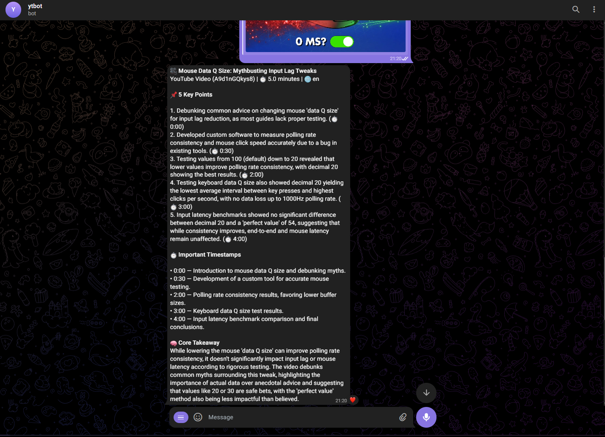
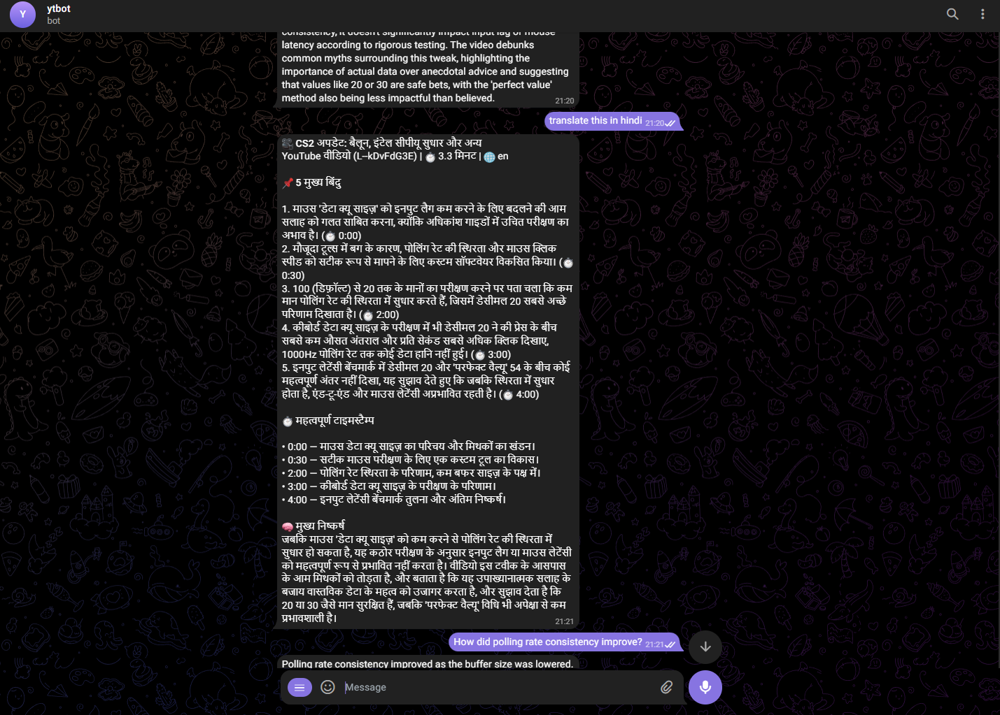
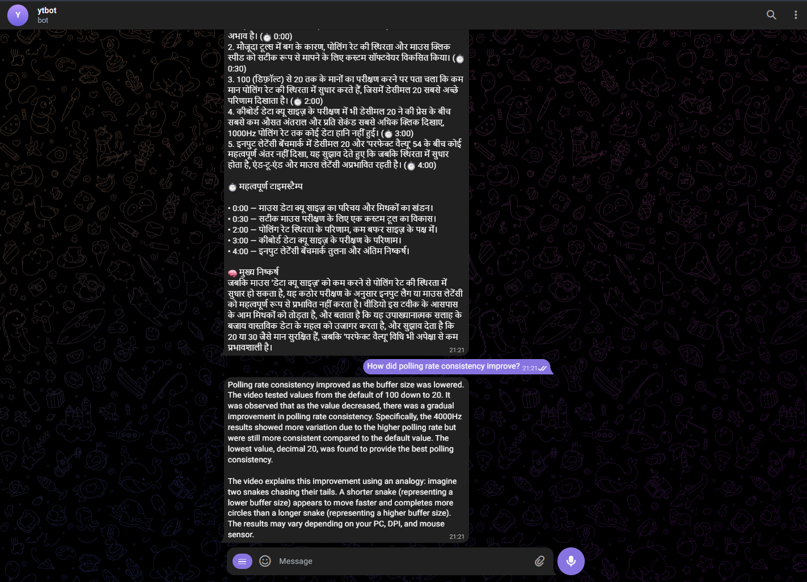
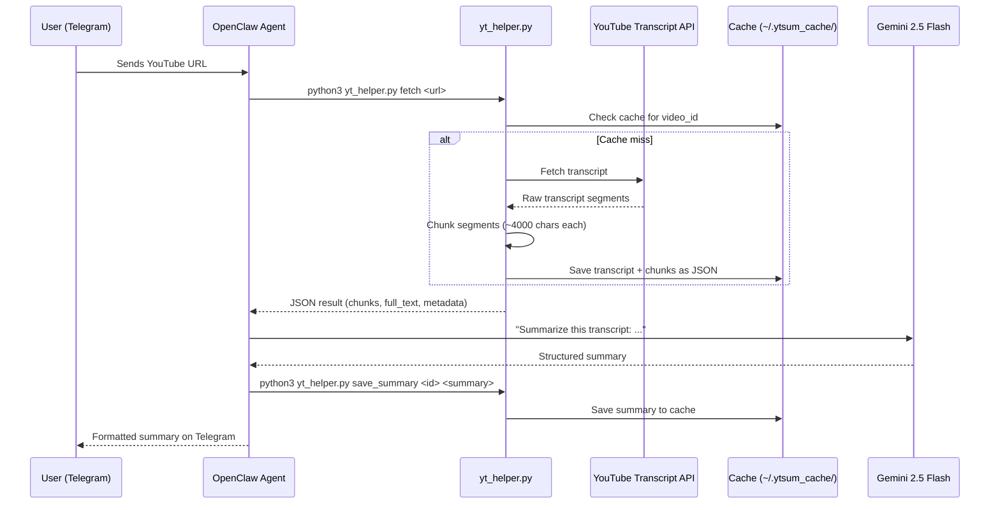
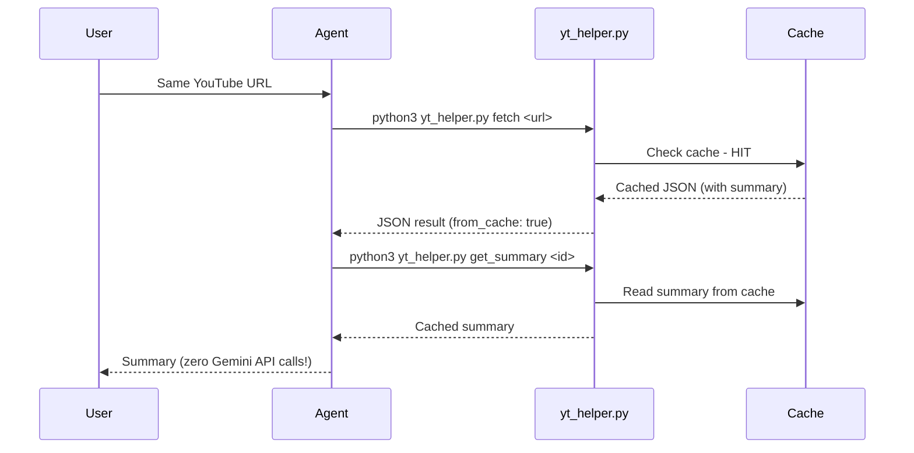

# YouTube Summarizer & Q&A Bot

A Telegram bot powered by **OpenClaw** and **Gemini** that helps users quickly understand YouTube videos through structured summaries, contextual Q&A, and multi-language support.

Getting the Summary - 

In a different lanugage -

Asking Questions -



---

## Diagrams

### First Request Flow



### Repeat Request Flow (Cached)

When another user (or the same user after a session restart) sends the same video:



---

## Features

| Feature | Description |
|---------|-------------|
| **Structured Summaries** | 5 key points, timestamps, and core takeaway |
| **Contextual Q&A** | Ask follow-up questions grounded in the transcript |
| **Multi-language** | English (default) + Multi-lingual support |
| **Caching** | File-based caching with 72h TTL |
| **Long Video Support** | Transcript chunking for videos of any length |
| **Error Handling** | Invalid URLs, missing transcripts, graceful failures |

---


### How It Works

1. **User sends a YouTube link** to the Telegram bot
2. **OpenClaw agent** receives the message and activates the YouTube Summarizer skill
3. **Agent executes** `yt_helper.py` via shell to fetch the transcript
4. **Transcript is cached** locally as JSON (72-hour TTL)
5. **Agent generates** a structured summary using Gemini, grounded in the transcript
6. **Summary is cached** — subsequent requests for the same video cost zero API calls
7. **Follow-up Q&A** uses cached transcript; answers cite specific timestamps

### Key Architectural Decisions

| Decision | Rationale |
|----------|-----------|
| **OpenClaw Skill** (not plugin) | Simpler to develop and debug; SKILL.md teaches the agent behavior without code changes |
| **File-based JSON cache** (not Redis/DB) | Zero external dependencies; human-readable; survives agent restarts |
| **Transcript chunking** (not embeddings) | Simple chunking + LLM reasoning is sufficient at this scale |
| **Agent-side summarization** | Saves API calls; Gemini handles the transcript in-context |
| **Prompt-based translation** | No extra API cost; Gemini handles multilingual generation natively |

---


## Project Structure

```
ytsum/                              # Project root
├── yt_helper.py                    # Main Python helper script
├── requirements.txt                # Python dependencies
├── screenshots/                    # Demo screenshots
└── README.md                       # This file

~/.openclaw/workspace/
└── SKILL.md                        # OpenClaw skill definition

~/.ytsum_cache/                     # Auto-created transcript cache
├── index.json                      # Cache metadata index
├── <video_id>.json                 # Cached transcript + summary
└── ...
```

---

## Setup

### Prerequisites

- **Python 3.12+**
- **Linux / macOS / WSL**
- **Telegram bot** created via [BotFather](https://t.me/BotFather)
- **Gemini API key**

### 1. Install OpenClaw

```bash
curl -fsSL https://openclaw.ai/install.sh | bash
openclaw onboard --install-daemon
```

During onboard, connect your Telegram bot and add your Gemini API key. Skip adding skills for now.

### 2. Clone & Install Dependencies

```bash
git clone https://github.com/shrutikcs/ytsum.git 
cd ~/ytsum
python3 -m pip install --break-system-packages youtube-transcript-api
# Or with venv:
# python3 -m venv venv && source venv/bin/activate && pip install -r requirements.txt
```

### 3. Set Up the Skill

Copy `SKILL.md` to the OpenClaw workspace:

```bash
cp ~/ytsum/SKILL.md ~/.openclaw/workspace/SKILL.md
```

Then open the OpenClaw dashboard and instruct the agent to read the SKILL.md file:

```bash
openclaw dashboard
```

### 4. Start & Test

```bash
openclaw
```

Send `/start` to your bot on Telegram to pair, then send any YouTube link:

```
https://www.youtube.com/watch?v=dQw4w9WgXcQ
```

---

## Usage

### Summarizing a Video

**User sends:**
```
https://www.youtube.com/watch?v=XXXXX
```

**Bot responds:**
```
Video Title
YouTube Video (XXXXX) | 12.5 minutes | en

5 Key Points
1. First key insight (0:45)
2. Second key insight (3:12)
3. Third key insight (5:30)
4. Fourth key insight (8:15)
5. Fifth key insight (10:42)

Important Timestamps
- 0:45 — Introduction to the topic
- 3:12 — Main argument presented
- 8:15 — Key example discussed

Core Takeaway
[Concise paragraph with the main insight]
```

### Asking Follow-up Questions

| User | Bot |
|------|-----|
| *"What did he say about pricing?"* | *"At 5:30, the speaker discusses pricing models..."* |
| *"What about customer retention?"* | *"This topic is not covered in the video."* |
| *"Summarize in Hindi"* | Responds in Hindi with the same structured format |

### Commands

| Command | Description |
|---------|-------------|
| `/summary` | Standard 5-point summary |
| `/deepdive` | Extended analysis with 10+ points and quotes |
| `/actionpoints` | Extract actionable items and recommendations |

---

## Technical Details

### Caching

Transcripts and summaries are cached as JSON files in `~/.ytsum_cache/` with a **72-hour TTL**:

```json
{
  "video_id": "abc123",
  "title": "YouTube Video (abc123)",
  "language": "en",
  "fetched_at": "2026-02-24T20:00:00+00:00",
  "duration_minutes": 12.5,
  "full_text": "Complete transcript text...",
  "segments": [
    {"start": 0.0, "duration": 4.5, "text": "Hello...", "timestamp": "0:00"}
  ],
  "chunks": [
    {"chunk_index": 0, "start_time": "0:00", "end_time": "3:30", "text": "..."}
  ],
  "summary": "Cached summary (saved after first generation)"
}
```

### Context Management

| State | How It Works |
|-------|--------------|
| **In-session** | Full transcript in agent's conversation context window |
| **Cross-session** | Agent reads cached transcript from disk via `yt_helper.py get_transcript` |
| **Long videos** | Transcript chunked into ~4000-char segments with timestamp boundaries |
| **Multiple videos** | Each video cached separately; agent asks which one to reference |

### Q&A Grounding Rules

- Only answers from transcript content (no hallucination)
- Cites timestamps when possible
- Never makes up information not in the transcript

### API Call Efficiency

With **20 Gemini API calls/day**, the architecture optimizes for minimal usage:

| Action | API Calls | Notes |
|--------|-----------|-------|
| First summary of a video | ~2 | Agent reasoning + summary generation |
| Repeat summary (cached) | ~1 | Agent reads cached summary from disk |
| Follow-up Q&A question | ~1 | Agent uses in-session context |
| Q&A after session restart | ~2 | Agent loads transcript from cache + answers |
| Same video, different user | ~1 | Summary served from cache |

**Effective capacity:** ~10-15 unique interactions per day.

### Edge Cases Handled

| Edge Case | Handling |
|-----------|----------|
| Invalid YouTube URL | Returns clear error with supported URL formats |
| No transcript available | Informs user that captions aren't enabled |
| Non-English transcript | Auto-detects available languages, uses first available |
| Very long video (>60 min) | Transcript truncated at ~100K chars with warning |
| Rate limiting | Caching minimizes API calls; 72h TTL on transcripts |
| Network errors | Graceful error messages |

---

## License

MIT
