# 🎬 YouTube Summarizer & Q&A Bot

A Telegram bot powered by **OpenClaw** and **Gemini** that helps users quickly understand YouTube videos through structured summaries, contextual Q&A, and multi-language support.

---

## OpenClaw Setup - 
Use Linux/macOS/WSL - 
curl -fsSL https://openclaw.ai/install.sh | bash

openclaw onboard --install-daemon

setup with telegram and add your api key.

skip adding all the skills and then run 

openclaw dashboard

Paste the SKILL.md file in home/<user>/.openclaw/workspace and command it to read the SKILL.md file.


## ✨ Features

| Feature | Description |
|---------|-------------|
| 📌 **Structured Summaries** | 5 key points, timestamps, and core takeaway |
| 🧠 **Contextual Q&A** | Ask follow-up questions grounded in the transcript |
| 🌐 **Multi-language** | English (default) + Hindi support |
| ⚡ **Smart Caching** | File-based caching with 72h TTL |
| ✂️ **Long Video Support** | Transcript chunking for videos of any length |
| 🛡️ **Error Handling** | Invalid URLs, missing transcripts, etc. |

---

## 🏗️ Architecture

```
┌──────────────────┐     ┌──────────────────┐     ┌──────────────────┐
│   User on        │────▶│   OpenClaw        │────▶│   Gemini        │
│   Telegram       │     │   Agent           │     │   Flash API      │
└──────────────────┘     └────────┬─────────┘     └──────────────────┘
                                  │
                         ┌────────▼─────────┐
                         │   yt_helper.py    │
                         │   (Python CLI)    │
                         └────────┬─────────┘
                                  │
                    ┌─────────────┼─────────────┐
                    ▼             ▼              ▼
             ┌───────────┐ ┌──────────┐  ┌───────────┐
             │ YouTube   │ │  JSON    │  │ Transcript │
             │ Transcript│ │  Cache   │  │ Chunking   │
             │ API       │ │  (.json) │  │ Engine     │
             └───────────┘ └──────────┘  └───────────┘
```


### How It Works

1. **User sends a YouTube link** to the Telegram bot
2. **OpenClaw agent** receives the message and activates the YouTube Summarizer skill
3. **Agent executes** `yt_helper.py` via shell to fetch the transcript
4. **Transcript is cached** locally as JSON (72-hour TTL)
5. **Agent generates** a structured summary using Gemini, grounded in the transcript
6. **Summary is cached** — subsequent requests for the same video cost zero API calls
7. **Follow-up Q&A** uses cached transcript; answers cite specific timestamps

### Key Architectural Decisions

| Decision | Rationale |
|----------|-----------|
| **OpenClaw Skill** (not plugin) | Simpler to develop and debug; SKILL.md teaches the agent behavior without code changes |
| **File-based JSON cache** (not Redis/DB) | Zero external dependencies; human-readable; survives agent restarts |
| **Transcript chunking** (not embeddings) | With 20 API calls/day, retrieval speed isn't the bottleneck. Simple chunking + LLM reasoning is sufficient |
| **Agent-side summarization** (not separate API) | Saves API calls; Gemini handles the transcript in-context |
| **Prompt-based translation** (not translation API) | No extra API cost; Gemini handles multilingual generation natively |

---

## 📁 Project Structure

```
ytsum/                              # Project root
├── yt_helper.py                    # Main Python helper script
├── requirements.txt                # Python dependencies
└── README.md                       # This file

~/.openclaw/workspace/skills/
└── youtube-summarizer/
    └── SKILL.md                    # OpenClaw skill definition

~/.ytsum_cache/                     # Auto-created transcript cache
├── index.json                      # Cache metadata index
├── <video_id>.json                 # Cached transcript + summary
└── ...
```

---

## 🚀 Setup Instructions

### Prerequisites

- **Python 3.12+**
- **OpenClaw** installed and running ([docs.openclaw.ai](https://docs.openclaw.ai))
- **Telegram bot** created via BotFather
- **Gemini API key** configured in OpenClaw

### Step 1: Clone & Install Dependencies

```bash
git clone <your-repo-url> ~/ytsum
cd ~/ytsum
python3 -m pip install --break-system-packages youtube-transcript-api
# Or with venv:
# python3 -m venv venv && source venv/bin/activate && pip install -r requirements.txt
```

### Step 2: Set Up OpenClaw Skill

The skill file should be placed at:
```
~/.openclaw/workspace/skills/youtube-summarizer/SKILL.md
```

If you cloned the repo, copy it:
```bash
mkdir -p ~/.openclaw/workspace/skills/youtube-summarizer/
cp ~/.openclaw/workspace/skills/youtube-summarizer/SKILL.md  # Already in place if setup via this project
```

### Step 3: Configure OpenClaw

Ensure your `~/.openclaw/openclaw.json` has:
```json
{
  "channels": {
    "telegram": {
      "enabled": true,
      "botToken": "YOUR_TELEGRAM_BOT_TOKEN"
    }
  },
  "agents": {
    "defaults": {
      "model": {
        "primary": "google/gemini-2.5-flash"
      }
    }
  }
}
```

### Step 4: Start OpenClaw

```bash
openclaw
```

Send `/start` to your bot on Telegram and complete the pairing.

### Step 5: Test the Bot

Send a YouTube link to your bot:
```
https://www.youtube.com/watch?v=dQw4w9WgXcQ
```

---

## 💬 Usage Examples

### Sending a YouTube Link

**User sends:**
```
https://www.youtube.com/watch?v=XXXXX
```

**Bot responds:**
```
🎥 Video Title
YouTube Video (XXXXX) | ⏱ 12.5 minutes | 🌐 en

📌 5 Key Points
1. First key insight (⏱ 0:45)
2. Second key insight (⏱ 3:12)
3. Third key insight (⏱ 5:30)
4. Fourth key insight (⏱ 8:15)
5. Fifth key insight (⏱ 10:42)

⏱ Important Timestamps
- 0:45 — Introduction to the topic
- 3:12 — Main argument presented
- 8:15 — Key example discussed

🧠 Core Takeaway
[Concise paragraph with the main insight]
```

### Asking Questions

**User:** `What did he say about pricing?`

**Bot:** `At 5:30, the speaker discusses pricing models. They mention that...`

**User:** `What about customer retention?`

**Bot:** `This topic is not covered in the video.`

### Multi-language Support

**User:** `Summarize in Hindi`

**Bot responds in Hindi with the same structured format.**

### Commands

| Command | Description |
|---------|-------------|
| `/summary` | Standard 5-point summary |
| `/deepdive` | Extended analysis with 10+ points and quotes |
| `/actionpoints` | Extract actionable items and recommendations |

---

## 🔧 How Transcript is Stored

Transcripts are cached as JSON files in `~/.ytsum_cache/`:

```json
{
  "video_id": "abc123",
  "title": "YouTube Video (abc123)",
  "language": "en",
  "fetched_at": "2026-02-24T20:00:00+00:00",
  "duration_minutes": 12.5,
  "full_text": "Complete transcript text...",
  "segments": [
    {"start": 0.0, "duration": 4.5, "text": "Hello...", "timestamp": "0:00"}
  ],
  "chunks": [
    {"chunk_index": 0, "start_time": "0:00", "end_time": "3:30", "text": "..."}
  ],
  "summary": "Cached summary (saved after first generation)"
}
```

**Cache TTL:** 72 hours. After expiry, transcript is re-fetched on next request.

---

## 📋 How Context is Managed

| State | How Context Works |
|-------|-------------------|
| **In-session** | Full transcript in agent's conversation context window |
| **Cross-session** | Agent reads cached transcript from disk via `yt_helper.py get_transcript` |
| **Long videos** | Transcript chunked into ~4000-char segments with timestamp boundaries |
| **Multiple videos** | Each video cached separately; agent asks user which video they're referencing |

---

## ❓ How Questions are Answered

1. Agent retrieves transcript (from session context or cache)
2. Searches for relevant sections based on user's question
3. Generates answer citing specific timestamps
4. If topic not found → responds: *"This topic is not covered in the video."*

**Rules:**
- ✅ Only answers from transcript content (no hallucination)
- ✅ Cites timestamps when possible
- ❌ Never makes up information

---

## 🧩 Chunking, Caching

| Technique | Used? | Rationale |
|-----------|-------|-----------|
| **File caching** | ✅ Yes | Transcripts + summaries cached as JSON files |
| **Chunking** | ✅ Yes | ~4000-char chunks for long videos |
| **Summary caching** | ✅ Yes | Generated summaries cached — zero API cost on repeat |

---

## ⚠️ Edge Cases Handled

| Edge Case | Handling |
|-----------|----------|
| Invalid YouTube URL | Returns clear error with supported URL formats |
| No transcript available | Informs user that captions aren't enabled |
| Non-English transcript | Auto-detects available languages and uses first available |
| Very long video (>60 min) | Transcript truncated at ~25k tokens with warning |
| Rate limiting | Caching minimizes API calls; 72h TTL on transcripts |
| Network errors | Graceful error messages |

---

## 📊 API Call Efficiency

With **20 Gemini API calls/day**, the architecture optimizes for minimal usage:

| Action | API Calls | Notes |
|--------|-----------|-------|
| First summary of a video | ~2 | Agent reasoning + summary generation |
| Repeat summary (cached) | ~1 | Agent reads cached summary from disk |
| Follow-up Q&A question | ~1 | Agent uses in-session context |
| Q&A after session restart | ~2 | Agent loads transcript from cache + answers |
| Same video, different user | ~1 | Summary served from cache |

**Effective capacity:** ~10-15 unique interactions per day.

---

## 🖼️ Screenshots

### Bot in Action
> User sends a YouTube link → Bot responds with a structured summary including key points, timestamps, and core takeaway.


### Sequence Diagram

```mermaid
sequenceDiagram
    participant U as 👤 User (Telegram)
    participant O as 🤖 OpenClaw Agent
    participant Y as 🐍 yt_helper.py
    participant API as 🌐 YouTube Transcript API
    participant C as 📁 Cache (~/.ytsum_cache/)
    participant G as ✨ Gemini 2.5 Flash

    U->>O: Sends YouTube URL
    O->>Y: python3 yt_helper.py fetch <url>
    Y->>C: Check cache for video_id
    alt Cache miss
        Y->>API: Fetch transcript
        API-->>Y: Raw transcript segments
        Y->>Y: Chunk segments (~4000 chars each)
        Y->>C: Save transcript + chunks as JSON
    end
    Y-->>O: JSON result (chunks, full_text, metadata)
    O->>G: "Summarize this transcript: ..."
    G-->>O: Structured summary
    O->>Y: python3 yt_helper.py save_summary <id> <summary>
    Y->>C: Save summary to cache
    O-->>U: Formatted summary on Telegram
```



---

## 📄 License

MIT
